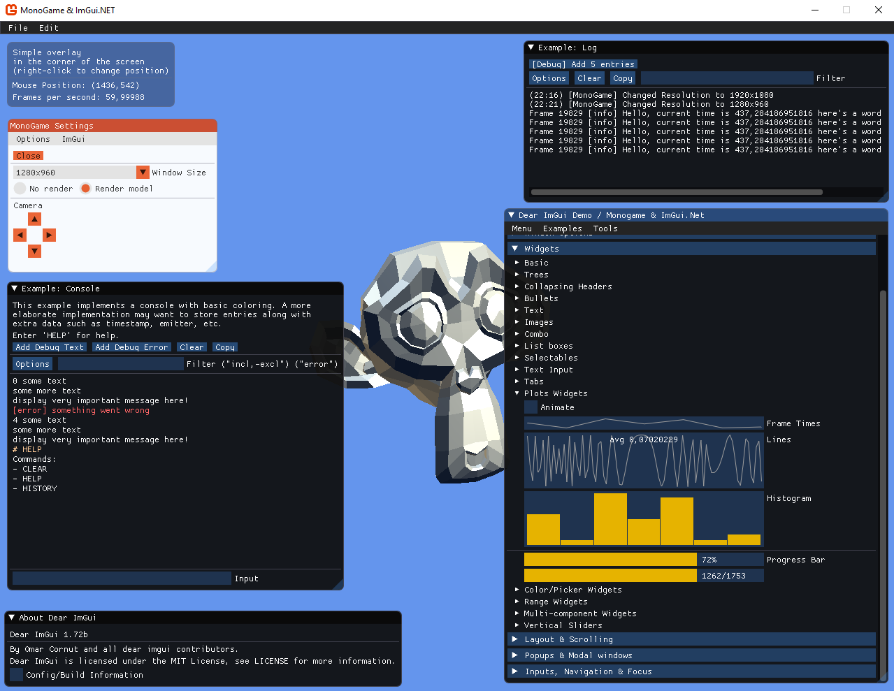

# MonoGame ImGui.NET examples

Features:
- Reimplemented demo windows from imgui_demo.cpp to c#
- Log, Console, Overlay
- Simple MonoGame example window

Requirements:
- MonoGame 3.7
- Visual Studio 2019